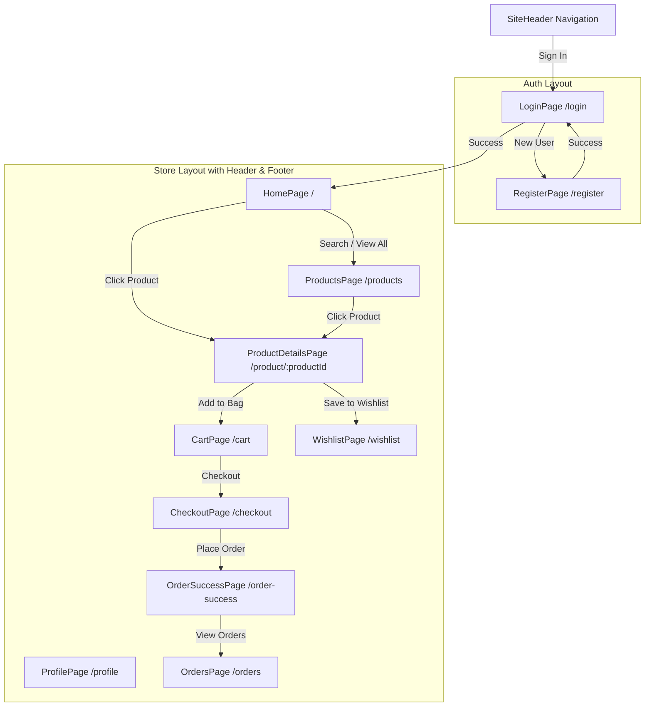

# Velora React: Project Architecture & Documentation

Welcome to **Velora**, a curated fashion e-commerce storefront. This document provides a detailed breakdown of the project's codebase, routing mechanism, state management architecture, styling structure, and data flows. 

This project is built using a **local-first** approach: it simulates a server and database using **Redux Toolkit** and **LocalStorage**, providing a fully persistent, fast shopping experience without an external backend.

---

## 🗺️ Page and Route Flow

Velora uses `react-router-dom` (version 6) for routing. The routing structure is defined in [App.jsx](file:///c:/Users/aksar/OneDrive/Desktop/WEB%20tutorial/Projects/Vellora%20React/src/App.jsx).

### 🛠️ Layout Wrappers
To avoid repeating headers and footers across pages, the app uses **nested routing** with Layout components:
1. **`StoreLayout`**: Wraps general shopping pages. It includes the [SiteHeader](file:///c:/Users/aksar/OneDrive/Desktop/WEB%20tutorial/Projects/Vellora%20React/src/components/SiteHeader.jsx), a central content zone, and the [SiteFooter](file:///c:/Users/aksar/OneDrive/Desktop/WEB%20tutorial/Projects/Vellora%20React/src/components/SiteFooter.jsx).
2. **`AuthLayout`**: Wraps authentication screens. It centres content on the screen and removes header/footer navigation to keep the focus on sign-in or registration.

The layout uses `Outlet` from `react-router-dom`, which serves as a placeholder where child components are rendered.

### 🚗 Routing Table and Flows

All pages are **lazy-loaded** using React's `lazy` and `Suspense` to optimize loading times. They only fetch code when a user navigates to them.

| Route Path | Component Name | Layout | Description |
| :--- | :--- | :--- | :--- |
| `/` | `HomePage` | `StoreLayout` | Showcases the hero banner, filters, category tabs, product catalog grid, and pagination. |
| `/products` | `ProductsPage` | `StoreLayout` | Comprehensive catalog with a search filter, category filter, sorting controls, and pagination. |
| `/product/:productId` | `ProductDetailsPage` | `StoreLayout` | Dynamic page for viewing product images, choosing sizes/colors, viewing and submitting reviews, and related products. |
| `/cart` | `CartPage` | `StoreLayout` | Shows selected items, handles quantity updates, item removals, displays order summary totals, and contains checkout triggers. |
| `/wishlist` | `WishlistPage` | `StoreLayout` | Displays user's saved items with options to directly move them to the cart or remove them. |
| `/checkout` | `CheckoutPage` | `StoreLayout` | Form to collect user shipping and profile details, and place orders. |
| `/orders` | `OrdersPage` | `StoreLayout` | Lists all order histories. |
| `/profile` | `ProfilePage` | `StoreLayout` | View/edit profile details (auto-populated if logged in). |
| `/order-success` | `OrderSuccessPage` | `StoreLayout` | Success page after completing a checkout. |
| `/login` | `LoginPage` | `AuthLayout` | Verification screen to sign in. Checks credentials against local users database. |
| `/register` | `RegisterPage` | `AuthLayout` | Form to register a new user in the local database. |
| `*` | `NotFoundPage` | None | Fallback page for unmatched URLs. |

### 🔄 Route Flow Diagram



---

## 💾 Data Flow & State Management (Redux Toolkit)

Velora uses **Redux Toolkit (RTK)** to manage global application state. The store configuration resides in [store.js](file:///c:/Users/aksar/OneDrive/Desktop/WEB%20tutorial/Projects/Vellora%20React/src/store.js).

### ⚡ Redux Store & LocalStorage Synchronization

To persist data without a backend, the Redux store uses a **hybrid loading and save mechanism**:

1. **Preloaded State (`preloadedState`)**:
   When the app mounts, it reads stored data using `safeRead(key, fallback)` from `localStorage` to initialize the store slices. This guarantees that user profiles, cart items, order history, and reviews are not lost on page refreshes.
   
2. **Storage Middleware (`storageMiddleware`)**:
   Instead of writing custom code in every slice, [store.js](file:///c:/Users/aksar/OneDrive/Desktop/WEB%20tutorial/Projects/Vellora%20React/src/store.js) registers a custom middleware:
   ```javascript
   const storageMiddleware = (storeApi) => (next) => (action) => {
     const result = next(action); // Let the action dispatch and update Redux
     const state = storeApi.getState(); // Get the new updated state
     try {
       // Write updated slices to localStorage
       localStorage.setItem('velora_cart', JSON.stringify(state.cart.items));
       localStorage.setItem('velora_wishlist', JSON.stringify(state.wishlist.items));
       localStorage.setItem('velora_users', JSON.stringify(state.auth.users));
       localStorage.setItem('velora_current_user', JSON.stringify(state.auth.currentUser));
       localStorage.setItem('velora_orders', JSON.stringify(state.orders.items));
       localStorage.setItem('velora_profiles', JSON.stringify(state.profile.items));
       localStorage.setItem('velora_reviews', JSON.stringify(state.reviews.items));
     } catch { /* ignore persistence errors */ }
     return result;
   };
   ```
   *Every time any Redux action is dispatched, this middleware intercepts the flow, updates the state, and silently saves the snapshot to localStorage.*

---

### 🧩 Redux Slices Breakdown

The application states are split into 6 focused slices under the [slices](file:///c:/Users/aksar/OneDrive/Desktop/WEB%20tutorial/Projects/Vellora%20React/src/slices) folder:

#### 1. `authSlice.js` (User Accounts and Login Sessions)
* **State**:
  * `users` (Array): Local database of registered users.
  * `currentUser` (Object | null): Currently authenticated user details (name, email).
* **Reducers / Actions**:
  * `registerUser(userObject)`: Pushes a new user credentials object into the `users` array.
  * `loginUser(userObject)`: Assigns the user payload to `currentUser`.
  * `logoutUser()`: Clears `currentUser` (sets it to `null`).
  * `updateCurrentUser(profileUpdates)`: Updates the current user's profile and updates the matching record inside the `users` array.

#### 2. `cartSlice.js` (Cart Mechanics with Options / Variants)
The cart has advanced logic to support product variants (different sizes/colors).
* **State**:
  * `items` (Array): Items in the cart.
* **Reducers / Actions**:
  * `addToCart(item)`: Handles addition. It checks for items matching both the product `id` **AND** `variantKey`.
    * If a match exists: Increments `quantity` of that specific variant.
    * If not: Pushes the new variant configuration with a default `quantity` of 1.
  * `removeFromCart({ id, variantKey })`: Filters out the item matching both `id` and `variantKey` from the array.
  * `updateQuantity({ id, variantKey, quantity })`: Sets the quantity of the matching item (guaranteed to be at least `1`).
  * `clearCart()`: Resets the cart to `[]` (run on checkout success).

#### 3. `wishlistSlice.js` (Saved Items)
* **State**:
  * `items` (Array): Wishlisted products.
* **Reducers / Actions**:
  * `toggleWishlist(product)`: Checks if a product exists by checking its `id`.
    * If it exists: Removes it (`splice`).
    * If not: Pushes it into the list.
  * `removeFromWishlist({ id })`: Directly filters out the item with the matching `id`.

#### 4. `ordersSlice.js` (Order Log)
* **State**:
  * `items` (Array): List of all completed orders.
  * `lastOrder` (Object | null): The most recently placed order.
* **Reducers / Actions**:
  * `placeOrder(orderObject)`: Adds the newly placed order to the top of the `items` history array (`unshift`) and updates `lastOrder`.

#### 5. `profileSlice.js` (Billing and Shipping Profiles)
* **State**:
  * `items` (Dictionary/Map): Keyed by user's email, storing their checkout/profile details.
* **Reducers / Actions**:
  * `saveProfile({ email, profile })`: Saves or overwrites the profile details associated with that email address.

#### 6. `reviewsSlice.js` (Product Reviews Feed)
* **State**:
  * `items` (Array): User-submitted product reviews.
* **Reducers / Actions**:
  * `addReview({ productId, review })`: Unshifts a new review containing author name, star rating, comment, and date onto the array.

---

### 📥 Variant Handling Data Flow Example

When a user adds an item from the details page, the app generates a `variantKey` based on their selections:

```
[User selects Size "M" and Color "Black"]
                    │
                    ▼
          [Generate variantKey]
    "Size:M|Color:Black" (String)
                    │
                    ▼
          [Dispatch addToCart()]
       { id: 1, name: "Shadow Hoodie", ..., variantKey: "Size:M|Color:Black" }
                    │
                    ▼
      [Inside cartSlice.addToCart]
   Does item with id:1 AND variantKey:"Size:M|Color:Black" exist in cart?
         ├── YES ──> Increment existing variant quantity by 1
         └── NO  ──> Push new item as a unique cart line item
```

---

## 🎨 Tailwind CSS and Styling Architecture

Velora uses a **hybrid styling architecture** combining **Tailwind CSS v4** and a modular, comprehensive stylesheet: [styles.css](file:///c:/Users/aksar/OneDrive/Desktop/WEB%20tutorial/Projects/Vellora%20React/src/styles.css).

### 🚀 Tailwind CSS v4 Configuration
The project uses the latest **Tailwind CSS v4** engine, compiled using `@tailwindcss/vite` in [vite.config.js](file:///c:/Users/aksar/OneDrive/Desktop/WEB%20tutorial/Projects/Vellora%20React/vite.config.js). 

Instead of old version configuration files (`tailwind.config.js`), Tailwind v4 is integrated directly in CSS via:
```css
@import 'tailwindcss';
```
This imports Tailwind's utility engine automatically.

### 🎨 The Hybrid Design Approach
1. **Utility-First (`Tailwind`)**: Classes are used inside components for dynamic layout structures (flexbox/grid), alignment, spacing adjustments (margins/padding), and state behaviors:
   * `grid gap-8 lg:grid-cols-[280px_1fr]` (Sets layout grid and responsive columns).
   * `h-28 w-full rounded-3xl object-cover` (Tailwind sizing, rounding, and fitting properties).
   * `flex flex-wrap items-center justify-between gap-3` (Standardizes responsive alignment).
   
2. **Component-First (`Custom CSS`)**: Global branding, custom visual styles, buttons, and layouts are defined as reusable, custom classes in `styles.css`. This separates theme definitions from layout utility calls:
   * **CSS Variables**: Core colors (`--velora-gold`, `--velora-ink`, `--velora-sand`), typography families (`--font-display` using *Playfair Display*, `--font-body` using *Space Grotesk*).
   * **Glassmorphism**: `.glass-panel` uses standard CSS `backdrop-filter: blur(18px)` and semi-transparent white borders to simulate glass.
   * **Custom Animations**: `.page-enter` controls the fade-in-and-slide-up transition when switching screens.
   * **The Cards**: `.soft-card` handles borders, blur filters, and depth using shadows.
   * **Buttons**: `.primary-btn` controls the main gradient colors (`linear-gradient(135deg, var(--velora-gold), #ea9c32)`) and elevation shadows.

---

## ⚙️ Core Helper Functions & Utilities

The app contains helper files to standardize repeated procedures:

### 📄 [storage.js](file:///c:/Users/aksar/OneDrive/Desktop/WEB%20tutorial/Projects/Vellora%20React/src/utils/storage.js)
1. **`safeRead(key, fallback)`**:
   Safely reads from localStorage. It checks if the item exists and can be successfully parsed. If it fails (due to corrupt data or undefined values), it returns the fallback value without crashing the app:
   ```javascript
   export const safeRead = (key, fallback) => {
     try {
       const raw = localStorage.getItem(key);
       return raw ? JSON.parse(raw) : fallback;
     } catch {
       return fallback;
     }
   };
   ```
2. **`formatCurrency(amount)`**:
   Formats numeric inputs to a Rupee currency string, fixed to 2 decimal places:
   `formatCurrency(1499) // Output: "₹1499.00"`
3. **`buildOrderId()`**:
   Generates a structured, semi-random order ID prefixed with `VLR` and timestamps:
   `buildOrderId() // Example: "VLR-1718698123456-7890"`

### 📦 [catalog.js](file:///c:/Users/aksar/OneDrive/Desktop/WEB%20tutorial/Projects/Vellora%20React/src/data/catalog.js)
1. **`getProductById(id)`**:
   Searches the catalog array for a matching product ID.
2. **`getProductBySlug(slug)`**:
   Searches the catalog array for a matching product URL slug. This allows human-readable URLs (like `/product/shadow-hoodie` instead of `/product/streetwear-shadow-hoodie`).

---

## 💡 Quick Start: Key Files to Explore

For learning purposes, here are the best places in the code to experiment with:

* **To see how pages are constructed and filtered**: Read [HomePage.jsx](file:///c:/Users/aksar/OneDrive/Desktop/WEB%20tutorial/Projects/Vellora%20React/src/pages/HomePage.jsx). You will see standard React hooks (`useState`, `useMemo`) working alongside Redux state dispatch actions.
* **To see URL-controlled states**: Look at [ProductsPage.jsx](file:///c:/Users/aksar/OneDrive/Desktop/WEB%20tutorial/Projects/Vellora%20React/src/pages/ProductsPage.jsx) to understand how the React Router hook `useSearchParams` coordinates filtering with search inputs.
* **To see how actions affect state**: Edit a slice under [src/slices](file:///c:/Users/aksar/OneDrive/Desktop/WEB%20tutorial/Projects/Vellora%20React/src/slices) (e.g. adding a coupon capability or discount rate to `cartSlice`).
